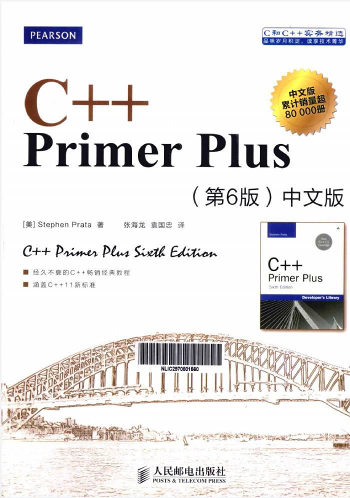

# Do-Not-Programming-Like-an-IOer

    从IOer入门到正式编程

## 学习好语言本身

    编程语言是编程的核心工具。如果你只通过信息竞赛接触编程，那么你很需要学好一门编程语言.

    就拿C++举例，中学阶段竞赛所学习的C++编程往往是竞赛专精版本的。要入门正式编程，需要学习较为完整的C++语法，比如说面向对象的编程思想，模板类型，函数重载重写，多文件项目等等。

> 简单学习C++语法可以先看这个网站 [C++ 教程 | 菜鸟教程 (runoob.com)](https://www.runoob.com/cplusplus/cpp-tutorial.html)
>
> 要继续深入学习可以看看这本书，完整的介绍了C++各方面语法，非常细致，对编程很有帮助。这本书上面有不到十处错误，买来需要先查阅勘误（我在19年买的，可能后续的修正了，不太清楚）
>
> 
